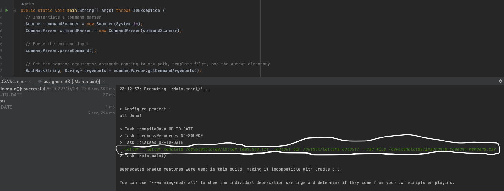
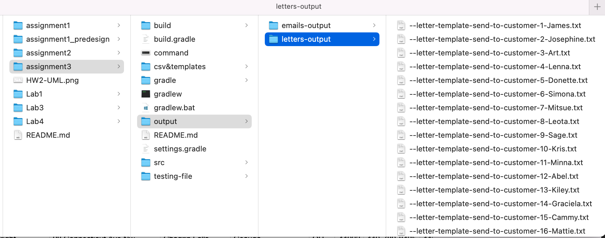

# Application Guide

1. Open the project by IntelliJ, and navigate to the <code>src/main/java/assignment3/problem1/Main</code>
2. In the <code>Main</code> program, execute the <code>main</code> function
3. Type in the command to generate messages for all customers. The format should be:  
  <code>--email --email-template (path) --letter --letter-template (path) --output-dir (path) --csv-file (path)</code>
  
4. For the way that this project organize the directories, you can type in below commands: 
<code>--letter --letter-template /csv&templates/letter-template.txt --output-dir /output/letters-output/ --csv-file /csv&templates/insurance-company-members.csv </code> 

5. You can also add the command: <code>--email --email-template /csv&templates/email-template.txt</code> randomly in the prompt, but all the messages will go to the same output directory 

6. Hence, I will suggest generate emails to <code>/output/emails-output/</code> and generate letters to <code>/output/letters-output/</code> separately

7. Finally, you can go to the <code>output</code> directory to check the output eamils or letters

8. The file format would be <code>--(email/letter)-template-send-to-customer-(No.)-(first_name).txt</code> 

UML: <code>src/main/java/assignment3/problem1/HW3_UML.png</code>